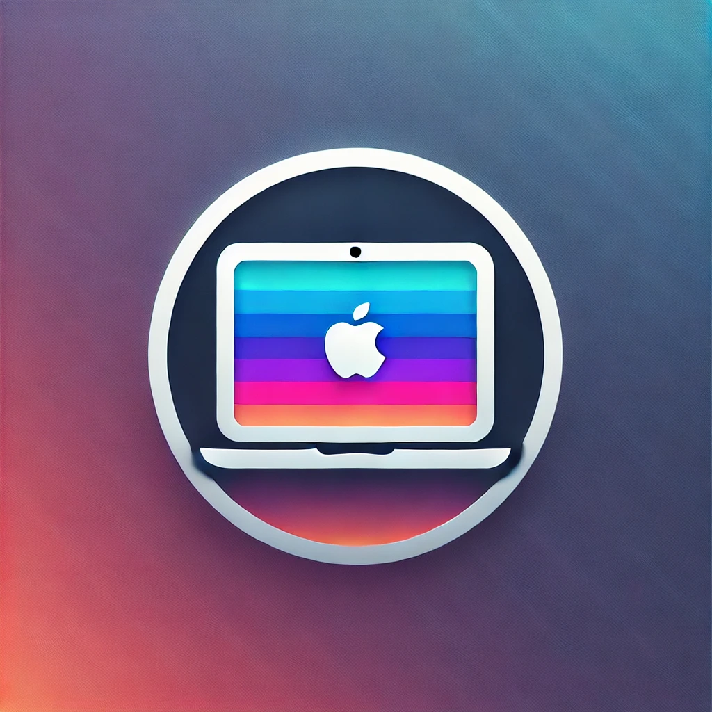

<div align="center">
  
</div>

<br>

<div align="center">

  [](https://github.com/marsdevx/macOS-config/commits/main "Last Commit")
  [](https://github.com/marsdevx/macOS-config "Languages")
  <br>
  [](https://github.com/marsdevx/macOS-config "Supported Platforms")
  [](https://github.com/marsdevx/macOS-config/tree/main/wallpapers "Wallpapers")
  [](https://github.com/marsdevx/macOS-config "Customization")
  [](https://github.com/marsdevx/macOS-config/blob/main/LICENSE "License")

</div>

---

#  macOS Config

**macOS Config** is an **open-source** project designed to streamline the setup of your **MacBook** with **custom** settings, **program installations**, and **wallpapers**. Built using **shell** scripts, this tool **automates** the process of **configuring** your **macOS environment** for **productivity** and **ricing**.

* Specifically designed for **macOS customization** and **ricing**.
* Includes `.sh` **scripts** to **install** all programs you need for **work**.
* Applies your custom settings for installed programs **automatically**.
* Adds your favorite **wallpapers** for a personalized **macOS experience**.

Transform your MacBook into a fully customized workspace with this powerful and efficient tool!

---

## 🖼️ Preview

<div align="center">
  
</div>

---

## 🛠️ Installation

To install this project, Launch the Terminal app on your system, and run the commands below. <br>
  - If a pop-up appears prompting you to download the Xcode Command Line Tools after the first command, click “Download” and then run the first command again.

1. **Clone repo**
```zsh
git clone https://github.com/marsdevx/macOS-config.git ~/Downloads/macOS-config
```

2. **Install Homebrew**
```zsh
/bin/bash -c "$(curl -fsSL https://raw.githubusercontent.com/Homebrew/install/HEAD/install.sh)"
echo 'eval "$(/opt/homebrew/bin/brew shellenv)"' >> ~/.zshrc
eval "$(/opt/homebrew/bin/brew shellenv)"
```

3. **Disable Desktop Icons**
```zsh
defaults write com.apple.finder CreateDesktop false; killall Finder
```

4. **Create Configuration Directory**
```zsh
mkdir -p ~/.config
```

5. **Update System Settings**

  - Accessibility and Control Centre
    - System Settings -> Accessibility -> Display -> Reduce motion -> On  
    - System Settings -> Control Centre -> Automatically hide and show the menu bar -> Always  

  - Desktop & Dock
    - System Settings -> Desktop & Dock -> Automatically hide and show the Dock -> On  
    - System Settings -> Desktop & Dock -> Automatically rearrange Spaces based on most recent use -> Off  
    - System Settings -> Desktop & Dock -> When switching to an application, switch to a Space ... -> Off  
    - System Settings -> Desktop & Dock -> Group windows by application -> Off  
    - System Settings -> Desktop & Dock -> Displays have separate Spaces -> On  

  - Keyboard
    - System Settings -> Keyboard -> Keyboard Shortcuts -> Spotlight -> Show Spotlight search -> Off  
    - System Settings -> Keyboard -> Keyboard Shortcuts -> Spotlight -> Show Finder search window -> Off  
    - System Settings -> Keyboard -> Keyboard Shortcuts -> Mission Control -> Switch to Desktop 1 -> On  
    - System Settings -> Keyboard -> Keyboard Shortcuts -> Mission Control -> Switch to Desktop 2 -> On  
    - System Settings -> Keyboard -> Keyboard Shortcuts -> Mission Control -> Switch to Desktop 3 -> On  
    - System Settings -> Keyboard -> Keyboard Shortcuts -> Mission Control -> Switch to Desktop 4 -> On  
    - System Settings -> Keyboard -> Keyboard Shortcuts -> Mission Control -> Switch to Desktop 5 -> On  

---

## 🚀 Usage

1. **Loop**

> Window manager

```zsh
zsh ~/Downloads/macOS-config/loop.sh
```

- After running the script, configure the Loop app with these settings
  - Accent Colour -> Wallpaper -> Gradient -> On  
  - Behaviour -> Launch at login -> On  
  - Behaviour -> Animation speed -> Smooth  
  - Behaviour -> Include padding -> On -> Configure padding -> 7px  
  - Behaviour -> Use screen with cursor -> Off  
  - Keybindings -> Centre -> Remove  
  - Keybindings -> Add -> General -> macOS Centre -> Fn + Enter 

<br>

2. **Raycast**

> Launching applications

```zsh
zsh ~/Downloads/macOS-config/raycast.sh
```

- After running the script, configure the Raycast app with these settings
  - Click Start Setup -> Continue.
  - Set a new hotkey: Record New Hotkey -> Assign Cmd + Space.
  - Click Continue to finalize.

<br>

3. **Sketchybar**

> Customizable top bar

```zsh
zsh ~/Downloads/macOS-config/sketchybar.sh
```

<br>

4. **SKHD**

> Hotkey manager

```zsh
zsh ~/Downloads/macOS-config/skhd.sh
```

<br>

5. **Yabai**

> Window manager for multiple workspaces

```zsh
zsh ~/Downloads/macOS-config/yabai.sh
```

<br>

5. **Iterm**

> Terminal app

- Install Oh My Zsh
```zsh
sh -c "$(curl -fsSL https://raw.githubusercontent.com/ohmyzsh/ohmyzsh/master/tools/install.sh)"
```

- Install Theme for Oh My Zsh
```zsh
git clone https://github.com/romkatv/powerlevel10k.git $ZSH_CUSTOM/themes/powerlevel10k
```

- Install and setup Iterm2
```zsh
zsh ~/Downloads/macOS-config/iterm.sh
```

- Update zshrc
```zsh
source ~/.zshrc
```

- Configure Powerlevel10k
  - Style: Lean
  - Character Set: Unicode
  - Color Scheme: 8 colors
  - Prompt Separator: No
  - Layout: Two lines
  - Connection Status: Disconnected
  - Prompt Alignment: Left
  - Accent Color: Blue
  - Prompt Density: Sparse
  - Icon Style: Many icons
  - Prompt Style: Concise
  - Instant Prompt: Yes
  - Verbosity: Verbose

- Configure iTerm2
  - Open iTerm2 and navigate to Settings.
    - General -> Closing -> Confirm "Quit iTerm2 (CmdQ)" -> Off
    - Appearance -> General -> Theme: Minimal
    - Appearance -> General -> Top bar location: Bottom
    - Appearance -> Windows -> Hide scrollbars -> On
    - Appearance -> Windows -> Show line under title bar ... -> Off
    - Appearance -> Panes -> Side margins: 8
    - Appearance -> Panes -> Top & bottom margins: 12
    - Profiles -> Colors -> Color Presets -> Import -> Downloads -> rose-pine.itermcolors
    - Profiles -> Colors -> Color Presets -> rose-pine
    - Profiles -> Window -> Transparency: 7
    - Profiles -> Text -> Font -> MesloLGS NF
    - Profiles -> Text -> Font size -> 13
    - Profiles -> Shell Integration -> Show mark indicators -> Off

<br>

6. **Wallpapers**

> My Wallpapers Configuration

- Open System Settings
  - Wallpaper -> Add Folder or Album -> Chose Folder -> Downloads -> macOS-config -> wallpapers
  - Click on the wallpapers folder at the bottom of the page
  - Adjust the settings:
    - Shuffle: Every Minute
    - Show on all Spaces: On

---

## 📋 License

All the code contained in this repo is licensed under the [MIT License](LICENSE)

```
MIT License

Copyright (c) 2025 marsdevx

Permission is hereby granted, free of charge, to any person obtaining a copy
of this software and associated documentation files (the "Software"), to deal
in the Software without restriction, including without limitation the rights
to use, copy, modify, merge, publish, distribute, sublicense, and/or sell
copies of the Software, and to permit persons to whom the Software is
furnished to do so, subject to the following conditions:

The above copyright notice and this permission notice shall be included in all
copies or substantial portions of the Software.

THE SOFTWARE IS PROVIDED "AS IS", WITHOUT WARRANTY OF ANY KIND, EXPRESS OR
IMPLIED, INCLUDING BUT NOT LIMITED TO THE WARRANTIES OF MERCHANTABILITY,
FITNESS FOR A PARTICULAR PURPOSE AND NONINFRINGEMENT. IN NO EVENT SHALL THE
AUTHORS OR COPYRIGHT HOLDERS BE LIABLE FOR ANY CLAIM, DAMAGES OR OTHER
LIABILITY, WHETHER IN AN ACTION OF CONTRACT, TORT OR OTHERWISE, ARISING FROM,
OUT OF OR IN CONNECTION WITH THE SOFTWARE OR THE USE OR OTHER DEALINGS IN THE
SOFTWARE.
```